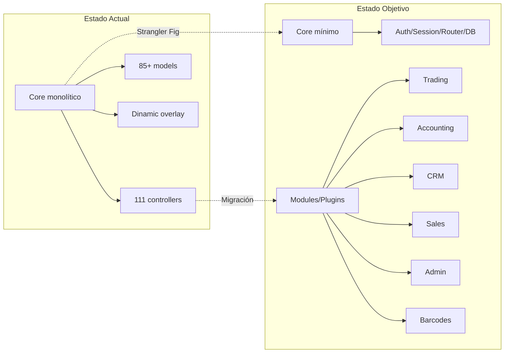
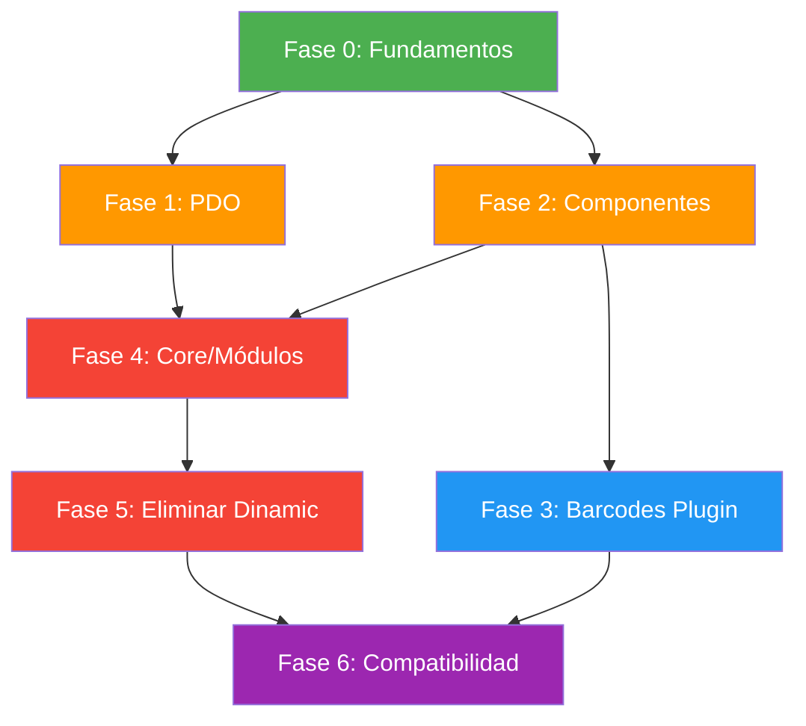

# Plan Maestro de Modernización — Tahiche

> **Versión**: 1.0  
> **Fecha**: 2026-04-25  
> **Autor**: Planificación asistida por IA para Rafael San José

---

## Visión general

Tahiche evoluciona de ser un fork de FacturaScripts a un **ERP moderno, modular y seguro**, manteniendo compatibilidad con el ecosistema legacy durante la transición. El proyecto sigue el patrón **Strangler Fig** para reemplazar componentes incrementalmente.

---

## Fases del proyecto

### Fase 0 — Fundamentos (Semanas 1-2) 🏗️

| Tarea | Documento | Dependencias | Riesgo |
|-------|-----------|-------------|--------|
| **0.1** Mover punto de entrada a `public/` | [03_entry_point.md](03_entry_point.md) | Ninguna | 🟢 Bajo |
| **0.2** Limpieza de imagen corporativa | [04_imagen_corporativa.md](04_imagen_corporativa.md) | Ninguna | 🟢 Bajo |
| **0.3** Documentar estado actual | [01_estado_actual.md](01_estado_actual.md) | Ninguna | 🟢 Bajo |

**Criterio de éxito**: El proyecto arranca desde `public/`, tiene identidad visual propia, y toda la documentación base está en `docs/`.

### Fase 1 — Base de datos unificada (Semanas 2-3) 🗄️

| Tarea | Documento | Dependencias | Riesgo |
|-------|-----------|-------------|--------|
| **1.1** Crear `PostgresqlPdoConnection` | [06_migracion_pdo.md](06_migracion_pdo.md) | Ninguna | 🟡 Medio |
| **1.2** Unificar `PdoEngine` para MySQL y PostgreSQL | [06_migracion_pdo.md](06_migracion_pdo.md) | 1.1 | 🟡 Medio |
| **1.3** Eliminar `MysqlEngine` y `PostgresqlEngine` | [06_migracion_pdo.md](06_migracion_pdo.md) | 1.2 + tests | 🟡 Medio |
| **1.4** Actualizar `DataBase.php` | [06_migracion_pdo.md](06_migracion_pdo.md) | 1.3 | 🟡 Medio |

**Criterio de éxito**: Solo existe `PdoEngine`, soporta MySQL y PostgreSQL, todos los tests pasan.

### Fase 2 — Componentes Alxarafe (Semanas 3-5) 🧩

| Tarea | Documento | Dependencias | Riesgo |
|-------|-----------|-------------|--------|
| **2.1** Crear componente `DataTable` | [08_alxarafe_components.md](08_alxarafe_components.md) | Ninguna | 🟡 Medio |
| **2.2** Crear campo `Autocomplete` | [08_alxarafe_components.md](08_alxarafe_components.md) | Ninguna | 🟡 Medio |
| **2.3** Crear campo `File/Upload` | [08_alxarafe_components.md](08_alxarafe_components.md) | Ninguna | 🟡 Medio |
| **2.4** Crear campo `Barcode` | [08_alxarafe_components.md](08_alxarafe_components.md) | Ninguna | 🟡 Medio |
| **2.5** Mejorar `RelationList` | [08_alxarafe_components.md](08_alxarafe_components.md) | 2.1 | 🟡 Medio |
| **2.6** Añadir campos auxiliares (Password, Email, Phone, Money) | [08_alxarafe_components.md](08_alxarafe_components.md) | Ninguna | 🟢 Bajo |

**Criterio de éxito**: `resource-controller` v0.3.0 con los nuevos componentes, test showcase actualizado.

### Fase 3 — Plugin de Códigos de Barras (Semanas 5-6) 🔖

| Tarea | Documento | Dependencias | Riesgo |
|-------|-----------|-------------|--------|
| **3.1** Diseño de modelo de datos | [09_plugin_barcodes.md](09_plugin_barcodes.md) | Ninguna | 🟢 Bajo |
| **3.2** Crear modelos y migraciones | [09_plugin_barcodes.md](09_plugin_barcodes.md) | 3.1 | 🟢 Bajo |
| **3.3** Crear controlador con nueva arquitectura | [09_plugin_barcodes.md](09_plugin_barcodes.md) | 2.1, 2.4 | 🟡 Medio |
| **3.4** Integrar búsqueda por código de barras | [09_plugin_barcodes.md](09_plugin_barcodes.md) | 3.2 | 🟡 Medio |
| **3.5** Tests y documentación | [09_plugin_barcodes.md](09_plugin_barcodes.md) | 3.3, 3.4 | 🟢 Bajo |

**Criterio de éxito**: Plugin funcional, buscar por EAN devuelve producto y cantidad, integrado como pestaña en EditProducto.

### Fase 4 — Separación Core / Módulos (Semanas 6-10) 🔪

| Tarea | Documento | Dependencias | Riesgo |
|-------|-----------|-------------|--------|
| **4.1** Clasificar controladores Core en dominios | [05_limpieza_nucleo.md](05_limpieza_nucleo.md) | Ninguna | 🟢 Bajo |
| **4.2** Mover controladores de Trading a Plugins | [05_limpieza_nucleo.md](05_limpieza_nucleo.md) | 4.1 | 🔴 Alto |
| **4.3** Mover controladores de Accounting a Plugins | [05_limpieza_nucleo.md](05_limpieza_nucleo.md) | 4.1 | 🔴 Alto |
| **4.4** Mover controladores de CRM a Plugins | [05_limpieza_nucleo.md](05_limpieza_nucleo.md) | 4.1 | 🔴 Alto |
| **4.5** Mover controladores de Sales a Plugins | [05_limpieza_nucleo.md](05_limpieza_nucleo.md) | 4.1 | 🔴 Alto |
| **4.6** Crear alias de compatibilidad | [10_compatibilidad_plugins.md](10_compatibilidad_plugins.md) | 4.2-4.5 | 🟡 Medio |

**Criterio de éxito**: Core solo tiene infraestructura. Los módulos de negocio están en Plugins. Los plugins existentes siguen funcionando.

### Fase 5 — Eliminación de Dinamic (Semanas 10-14) 🗑️

| Tarea | Documento | Dependencias | Riesgo |
|-------|-----------|-------------|--------|
| **5.1** Auditar todas las referencias a `Dinamic\` | [07_eliminacion_dinamic.md](07_eliminacion_dinamic.md) | Ninguna | 🟢 Bajo |
| **5.2** Crear mecanismo alternativo de override | [07_eliminacion_dinamic.md](07_eliminacion_dinamic.md) | 5.1 | 🔴 Alto |
| **5.3** Migrar plugins a nuevo mecanismo | [07_eliminacion_dinamic.md](07_eliminacion_dinamic.md) | 5.2 | 🔴 Alto |
| **5.4** Eliminar Dinamic/ y deploy de proxies | [07_eliminacion_dinamic.md](07_eliminacion_dinamic.md) | 5.3 + tests | 🔴 Alto |

**Criterio de éxito**: Sin carpeta `Dinamic/`, plugins funcionan con el nuevo mecanismo.

### Fase 6 — Compatibilidad y pulido (Semanas 14-16) ✨

| Tarea | Documento | Dependencias | Riesgo |
|-------|-----------|-------------|--------|
| **6.1** Test exhaustivo de plugins existentes | [10_compatibilidad_plugins.md](10_compatibilidad_plugins.md) | Fases 4-5 | 🟡 Medio |
| **6.2** Documentar guía de migración para developers | [10_compatibilidad_plugins.md](10_compatibilidad_plugins.md) | 6.1 | 🟢 Bajo |
| **6.3** Actualizar CI/CD | — | Todo | 🟢 Bajo |
| **6.4** Release candidate | — | Todo | 🟡 Medio |

---

## Diagrama de dependencias

---

## Principios rectores

1. **Compatibilidad primero**: Cada fase debe terminar con todos los plugins existentes funcionando.
2. **Tests antes de borrar**: No se elimina código legacy sin tener tests que verifiquen la funcionalidad equivalente.
3. **Incrementalidad**: Cada tarea produce un commit funcional. No hay "big bang".
4. **Copyrights respetados**: Los archivos en `Core/` mantienen el copyright de FacturaScripts. Los nuevos archivos llevan el copyright de Rafael San José.
5. **Un módulo a la vez**: La separación Core → Plugins se hace módulo por módulo, empezando por el más aislado.

---

## Métricas de progreso

| Métrica | Actual | Objetivo |
|---------|--------|----------|
| Controladores en Core | 111 | ~15 (infraestructura) |
| Controladores en Modules | 43 | 111+ |
| Motores DB | 3 (mysqli, pg, pdo) | 1 (PDO) |
| Archivos en Dinamic | 1129 | 0 |
| Cobertura tests | ? | >60% |
| Componentes resource-controller | 15 campos | 25+ campos |
