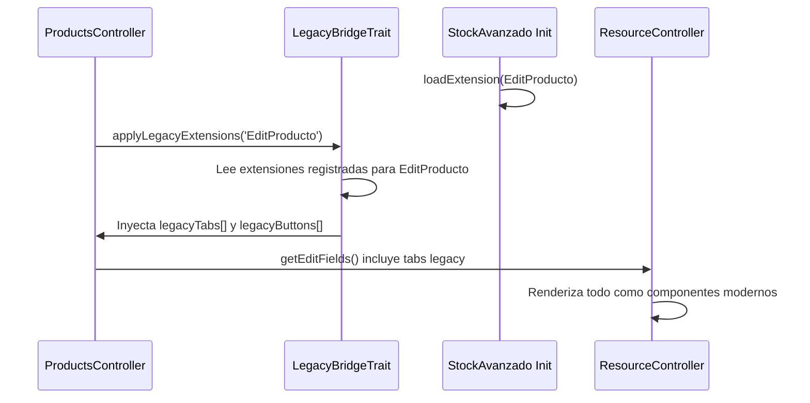

# Eliminación de la carpeta Dinamic

> **Fase**: 5 (largo plazo)  
> **Prioridad**: Media  
> **Riesgo**: 🔴 Alto (para eliminación total), 🟢 Bajo (para dejar de usarla)

---

## Principio clave

> **Dinamic puede mantenerse para que los plugins legacy sigan funcionando, pero el código nuevo de Tahiche NO debe usar Dinamic en ningún caso.** El mecanismo `LegacyBridgeTrait` ya ha demostrado que se pueden interceptar las extensiones de plugins legacy (ej: pestaña "Movimientos" de StockAvanzado en EditProducto) sin depender de Dinamic.

## ¿Qué es Dinamic?

Dinamic es un sistema de **overlay de clases** de FacturaScripts. Cuando se activa un plugin, el sistema de deploy genera clases "proxy" en `Dinamic/` que extienden las del Core, permitiendo que los plugins las sobrescriban.

### Ejemplo del flujo:

```
1. Core/Controller/EditProducto.php        ← Clase original
2. Plugin/StockAvanzado/Extension/Controller/EditProducto.php  ← Extensión
3. Dinamic/Controller/EditProducto.php     ← Proxy generado automáticamente
   → extends Core\Controller\EditProducto + aplica extensiones
```

### Estadísticas actuales

| Subdirectorio | Archivos | Descripción |
|--------------|----------|-------------|
| `Dinamic/Controller/` | ~100+ | Proxies de controladores |
| `Dinamic/Model/` | ~80+ | Proxies de modelos |
| `Dinamic/Lib/` | ~200+ | Proxies de librerías |
| `Dinamic/Assets/` | Varios | Assets procesados |
| `Dinamic/View/` | Varios | Vistas procesadas |
| `Dinamic/XMLView/` | Varios | XMLViews combinados |
| **Total** | **~1129** | Archivos generados |

## Estrategia: dos niveles

### Nivel 1 — Inmediato: No usar Dinamic en código nuevo ✅

**Ya implementado** mediante `LegacyBridgeTrait`:

```php
// Modules/Trading/Controller/ProductsController.php
class ProductsController extends ResourceController
{
    use LegacyBridgeTrait;  // ← Intercepta extensiones legacy SIN Dinamic
    
    public function getEditFields(): array
    {
        // Carga tabs inyectadas por plugins legacy (ej: StockAvanzado)
        $this->applyLegacyExtensions('EditProducto');
        
        // Las extensiones se añaden como tabs en el sistema moderno
        foreach ($this->legacyTabs as $tab) { ... }
    }
}
```

**Regla**: Todo controlador nuevo en `Modules/` usa `ResourceController` + `LegacyBridgeTrait`, nunca `FacturaScripts\Dinamic\*`.

### Nivel 2 — Largo plazo: Eliminación de Dinamic

Cuando **todos** los controladores y modelos estén migrados a la nueva arquitectura:

1. Los plugins legacy pueden seguir usando `FacturaScripts\Core\*` directamente
2. Las extensiones se interceptan via `LegacyBridgeTrait` o un `HookContract`
3. La carpeta `Dinamic/` se puede eliminar junto con el sistema de deploy

## Referencias a Dinamic en el código actual de Tahiche

### En `src/` (código nuevo) — A eliminar progresivamente

```php
// src/Infrastructure/Http/Kernel.php — Línea 19
use FacturaScripts\Dinamic\Model\User as DinUser;
// → Debería usar FacturaScripts\Core\Model\User directamente

// Modules/Trading/Controller/ProductsController.php — Líneas 48-49
$familias = $this->getSelectOptions('\\FacturaScripts\\Dinamic\\Model\\Familia', ...);
// → Debería usar \\FacturaScripts\\Core\\Model\\Familia o Modules\\Trading\\Model\\Family
```

### En `Core/` (legacy) — Se mantiene

El Core legacy sigue usando Dinamic internamente para su propio routing:
```php
// Core/Kernel.php línea 170
$controller = '\\FacturaScripts\\Dinamic\\Controller\\' . $route;
```
Esto se mantiene mientras el legacy Kernel esté activo.

### En `composer.json`

```json
"FacturaScripts\\Dinamic\\": "Dinamic/"
```
Se mantiene para los plugins legacy.

## Plan de acción paso a paso

### Fase inmediata (ahora)

- [x] No usar `Dinamic\*` en controladores nuevos de `Modules/`
- [x] `LegacyBridgeTrait` funciona para interceptar extensiones de plugins
- [ ] Refactorizar `src/Infrastructure/Http/Kernel.php` para no usar `Dinamic\Model\User`
- [ ] Refactorizar controladores en `Modules/` que hacen `use ...\Dinamic\Model\*` para usar `Core\Model\*` directamente

### Fase de convivencia (durante el estrangulamiento)

- [ ] Dinamic sigue existiendo y funcional para el routing legacy
- [ ] Los plugins legacy siguen desplegándose a Dinamic
- [ ] Los nuevos módulos ignoran Dinamic completamente

### Fase de eliminación (post-estrangulamiento)

- [ ] Todos los controladores migrados a `Modules/`
- [ ] Mecanismo de override alternativo implementado (service container, decorators)
- [ ] Migración de plugins legacy a nuevo sistema de extensiones
- [ ] Eliminación de `Dinamic/` y del sistema de deploy
- [ ] Eliminar namespace de `composer.json`

## LegacyBridgeTrait — El mecanismo probado

El trait `LegacyBridgeTrait` (en `src/Infrastructure/Http/LegacyBridgeTrait.php`) demuestra que es posible:

1. **Leer las extensiones** que un plugin legacy registra para un controlador específico
2. **Convertirlas** en pestañas y botones del sistema moderno `ResourceController`
3. **Renderizarlas** dentro del layout nuevo sin pasar por Dinamic

Esto ya funciona con StockAvanzado inyectando la pestaña "Movimientos" en `ProductsController` moderno.

### Flujo del LegacyBridgeTrait



## Checklist

- [x] Demostrado que LegacyBridgeTrait funciona con StockAvanzado
- [ ] Refactorizar `use Dinamic\*` en código de `src/` y `Modules/`
- [ ] Documentar para plugin developers cómo funcionará el nuevo sistema
- [ ] Mantener Dinamic funcional para legacy routing
- [ ] A largo plazo: diseñar mecanismo de override sin Dinamic
