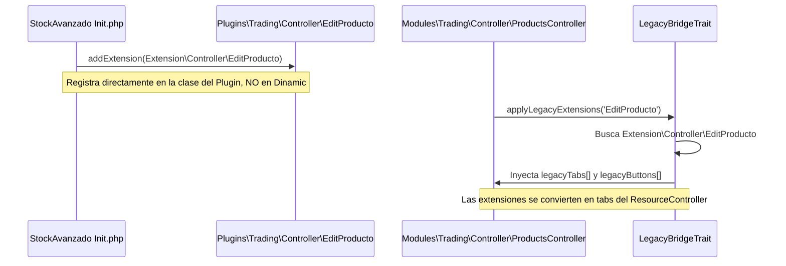

# Análisis exhaustivo del sistema Dinamic y plan de estrangulamiento

> **Objetivo**: Eliminar la carpeta `Dinamic/` manteniendo compatibilidad con plugins legacy (Core + Plugins).  
> **Principio**: `src/` y `Modules/` NUNCA usan Dinamic. Core y Plugins lo siguen usando durante la transición.

---

## 1. ¿Qué hace exactamente Dinamic?

Dinamic cumple **6 funciones distintas**, cada una con su propio mecanismo y nivel de dificultad para estrangular:

| # | Función | Mecanismo | Archivos generados | Dificultad |
|---|---------|-----------|-------------------|------------|
| F1 | **Proxy de Controladores** con ExtensionsTrait | Clase proxy que hereda + `use ExtensionsTrait` | 116 | 🟢 Ya estrangulada |
| F2 | **Proxy de Modelos** (herencia simple) | Clase proxy que hereda sin extensiones | 111 | 🟡 Media |
| F3 | **Proxy de Libs** (herencia simple) | Clase proxy que hereda sin extensiones | 140 | 🟡 Media |
| F4 | **Merge de XMLViews** | Fusión XML de Core + extensiones de plugins | 140 | 🟠 Alta |
| F5 | **Copia de Assets/Views/Data** | Copia directa de archivos estáticos | 273 | 🟢 Baja |
| F6 | **Routing dinámico** | Core/Kernel escanea `Dinamic/Controller/` | N/A | 🟢 Ya estrangulada |
| F7 | **Persistencia de Namespaces** | Mapeo de clases movidas (Core -> Plugins) | N/A | 🔴 Crítico |

---

## 2. F1 — Proxy de Controladores con ExtensionsTrait

### Qué hace
Genera clases proxy en `Dinamic/Controller/` que heredan del controlador real y añaden `ExtensionsTrait`. Esto permite que los plugins inyecten métodos (closures) en los controladores via `addExtension()`.

### Ejemplo de proxy generado
```php
// Dinamic/Controller/EditProducto.php (generado automáticamente)
<?php namespace FacturaScripts\Dinamic\Controller;
class EditProducto extends \FacturaScripts\Plugins\Trading\Controller\EditProducto
{
    use \FacturaScripts\Core\Template\ExtensionsTrait;
}
```

### Dónde se genera
- `PluginsDeploy.php:230-263` — `linkPHPFile()` genera el proxy
- `PluginsDeploy.php:123-126` — `extensionSupport()` decide si añadir ExtensionsTrait (solo para `FacturaScripts\Dinamic\Controller`)

### Quién lo consume
- **StockAvanzado Init.php** registra extensiones directamente en los controladores de Plugins:
  ```php
  // Plugins/StockAvanzado/Init.php:52-58
  \FacturaScripts\Plugins\Trading\Controller\EditProducto::addExtension(new Extension\Controller\EditProducto());
  ```
- **Core/Kernel.php** enruta a `Dinamic\Controller\*`
- **InitClass::loadExtension()** usa `Dinamic\Controller\*` para extensiones genéricas

### Estado de estrangulamiento: ✅ YA ESTRANGULADA

Los controladores nuevos en `Modules/` usan `LegacyBridgeTrait` que intercepta las extensiones de plugins sin pasar por Dinamic. StockAvanzado ya registra sus extensiones directamente en las clases de `Plugins\Trading\Controller\*`, no en `Dinamic\Controller\*`.

**Evidencia**: `StockAvanzado/Init.php` usa `\FacturaScripts\Plugins\Trading\Controller\EditProducto::addExtension()` (no Dinamic).

---

## 3. F2 — Proxy de Modelos (herencia simple)

### Qué hace
Genera clases proxy vacías en `Dinamic/Model/` que heredan del modelo real. **NO añade ExtensionsTrait** (excepto indirectamente via `ModelTrait`).

### Ejemplo de proxy generado
```php
// Dinamic/Model/Producto.php
<?php namespace FacturaScripts\Dinamic\Model;
class Producto extends \FacturaScripts\Plugins\Trading\Model\Producto
{
}
```

### Para qué sirve realmente
1. **Indirección**: Permite que un plugin sobrescriba un modelo del Core.
2. **Resolución dinámica**: El código usa `Dinamic\Model\X` y siempre obtiene la versión "ganadora" (último plugin activado).

### Dónde se usa en el código

#### En Core/Model (references `use Dinamic\Model\*`)
Se usa en multitud de clases como `User.php`, `Empresa.php`, `DocTransformation.php` y en clases `Join\*`.

#### En Core/Controller (constantes MODEL_NAMESPACE)
Clases como `DocumentStitcher.php`, `SendMail.php` y `Wizard.php` usan la constante `MODEL_NAMESPACE = '\FacturaScripts\Dinamic\Model\'`.

#### En Core/Lib
Varias librerías y el motor API resuelven modelos prefijando la cadena dinámicamente.

### Estrategia de estrangulamiento

**El problema real**: `Dinamic\Model` sirve como **service locator**.
**Solución para `src/` y `Modules/`**: Usar directamente `Core\Model\*` o `Plugins\{Plugin}\Model\*`.
**Solución para Core legacy**: Crear un `ModelResolver` que reemplace la constante `MODEL_NAMESPACE`:
```php
class ModelResolver {
    public static function resolve(string $modelName): string {
        // 1. Buscar en Plugins activos (orden inverso de prioridad)
        // 2. Fallback a Core\Model\$modelName
        return $resolvedClass;
    }
}
```

---

## 4. F3 — Proxy de Libs (herencia simple)

### Qué hace
Igual que F2 pero para `Dinamic/Lib/`. Genera proxies vacíos que heredan de la Lib real.

### Dónde se usa
- Instanciación dinámica por nombre de clase (Ej. `Widget\VisualItemLoadEngine`, `ExportManager`).
- Referencias directas `use Dinamic\Lib\*` en Modelos.

### Estrategia de estrangulamiento
Mismo patrón que F2. Requiere un resolver de librerías (`LibResolver`).

---

## 5. F4 — Merge de XMLViews

### Qué hace
Fusiona XMLViews del Core con extensiones XML de plugins. El resultado combinado va a `Dinamic/XMLView/`.

### Quién lee los XMLView fusionados
Los controladores del tipo `ExtendedController` leen de `Dinamic/XMLView/` para construir sus vistas.

### Estado: ⚠️ NO estrangulada — pero irrelevante para Modules
Los controladores en `Modules/` usan `ResourceController` con campos declarativos en PHP. Esta función es **solo para el flujo legacy** y se elimina naturalmente cuando todos los controladores migren.

---

## 6. F5 — Copia de Assets, Views, Data, Tables, Translations

### Qué hace
Copia archivos estáticos de Core y Plugins a `Dinamic/`.

### Estrategia
Los assets y views de `Modules/` se sirven desde sus propias rutas. Para el legacy, se mantiene hasta la migración completa.

---

## 7. F6 — Routing dinámico

### Qué hace
`Core/Kernel.php` escanea `Dinamic/Controller/` para construir la tabla de rutas.

### Estado: ✅ ESTRANGULADA para Modules
El `src/Infrastructure/Http/Kernel.php` despacha rutas de `Modules/` via `?module=X&controller=Y`, sin tocar Dinamic. El Core/Kernel sigue usando Dinamic.

---

## 8. El sistema de Extensiones (cómo los plugins inyectan funcionalidad)

### Flujo actual SIN Dinamic (Modules — ya funcional)



---

## 9. El problema de los Namespaces Migrados (Punto Crítico)

Como bien señalas, al mover clases del núcleo a plugins (ej: `EditProducto` movido de `Core` a `Plugins/Trading`), rompemos los plugins legacy originales que no han sido modificados.

### El conflicto
1. **Plugin Original (sin modificar)**: Hace `\FacturaScripts\Core\Controller\EditProducto::addExtension(...)`.
2. **Realidad en Tahiche**: La clase ya no existe en el `Core`. Ahora está en `Plugins\Trading`.
3. **Consecuencia**: Error "Class not found". La estrangulación falla porque dependemos de haber modificado el plugin.

### Solución: Sistema de Aliasing de Compatibilidad

Para eliminar Dinamic sin obligar a modificar todos los plugins del ecosistema, Tahiche debe implementar un mapeo de namespaces.

#### 1. Uso de class_alias()
Podemos registrar alias durante la carga de módulos:
```php
class_alias(
    '\FacturaScripts\Plugins\Trading\Controller\EditProducto',
    '\FacturaScripts\Core\Controller\EditProducto'
);
```
Esto permite que el plugin original encuentre la clase en su ubicación antigua, pero las extensiones se registren en la clase nueva.

#### 2. Resolución inteligente en LegacyBridgeTrait
El `LegacyBridgeTrait` no debe buscar solo por el nombre exacto del controlador, sino que debe tener un "Mapa de Migración":

```php
protected function applyLegacyExtensions(string $legacyControllerName): void
{
    // Mapa de clases que han cambiado de sitio
    $migrationMap = [
        'EditProducto' => 'Trading\Controller\EditProducto',
        'ListProducto' => 'Trading\Controller\ListProducto',
    ];
    
    // 1. Buscar en la ubicación nueva (Plugin)
    // 2. Buscar en la ubicación antigua (Core)
    // 3. Buscar en Dinamic (mientras exista)
}
```

### ¿Por qué parece que funciona ahora?
Actualmente, el sistema "funciona" porque `PluginsDeploy` genera un proxy en `Dinamic\Controller\EditProducto` que hereda de la ubicación nueva (`Trading`). Como la mayoría de plugins usan `loadExtension()`, el sistema Dinamic actúa como un "aliasing automático".

**Al eliminar Dinamic, este aliasing debe pasar a ser explícito en el código del núcleo o del bridge.**

---

## 10. Referencias a Dinamic en src/ y Modules/ (a eliminar)

No hay referencias a Dinamic en `Modules/`.
En `src/Infrastructure/Http/Kernel.php` L70-100 hay guardias de arquitectura que detectan y prohíben su uso (se debe mantener como guardia).

---

## 10. El componente `InitClass::loadExtension()` — Punto crítico

Es el **punto de acoplamiento principal** entre plugins y Dinamic, haciendo un fallback a `\FacturaScripts\Dinamic\` si no lo encuentra.

### Estrategia
Refactorizar `InitClass::loadExtension()` para buscar en `Plugins\*` y `Core\*` directamente, con Dinamic como último fallback.

---

## 11. Plan de estrangulamiento por fases

### Fase 0 — Estado actual ✅
- **F1** y **F6** estranguladas. `Modules/` limpio.

### Fase 1 — Limpiar src/ (inmediato, bajo riesgo)
- Asegurar cero usos (solo guardias).

### Fase 2 — Desacoplar InitClass::loadExtension() (medio plazo)
- Buscar extensiones directamente en los namespaces de los plugins cargados en lugar de en `Dinamic\`.

### Fase 3 — Crear ModelResolver (medio plazo)
- Reemplazar `MODEL_NAMESPACE = '\FacturaScripts\Dinamic\Model\'` en todo el Core.

### Fase 4 — Crear LibResolver (largo plazo)
- Misma estrategia que F3 para `ExportManager`, etc.

### Fase 5 — Migrar XMLViews a campos declarativos (largo plazo)
- Se resuelve solo conforme se migran controladores a Hexagonal.

### Fase 6 — Eliminación de Dinamic (post-migración total)
- Eliminar `PluginsDeploy::run()`, la carpeta `Dinamic/`, y el namespace de `composer.json`.
