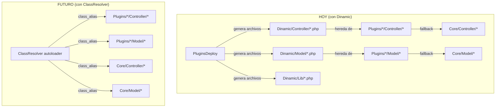

# Diccionario de Namespaces: ClassResolver

> **Problema**: Al mover clases de `Core` a `Plugins` (ej: `EditProducto` → `Trading`), los plugins legacy
> que no hemos modificado siguen referenciando `FacturaScripts\Core\Controller\EditProducto` o
> `FacturaScripts\Dinamic\Controller\EditProducto`. Sin un mecanismo de resolución, fallan con "Class not found".
>
> **Solución**: Un autoloader inteligente que actúa como "diccionario" y resuelve automáticamente
> dónde vive realmente cada clase, sin necesidad de la carpeta `Dinamic/`.

---

## 1. Lo que Dinamic hace hoy (y que necesitamos replicar)

Cuando `PluginsDeploy` genera los proxies, recorre las carpetas en este orden:

```
Plugins activados (en orden inverso de prioridad) → Core
```

El **primer** archivo que encuentra "gana". El proxy en `Dinamic/` siempre hereda de esa versión ganadora:

```php
// Dinamic/Controller/EditProducto.php → hereda de Plugins\Trading (ganó)
// Dinamic/Controller/Dashboard.php    → hereda de Core (nadie lo sobrescribió)
// Dinamic/Model/User.php              → hereda de Plugins\Admin (ganó)
// Dinamic/Model/Producto.php          → hereda de Plugins\Trading (ganó)
```

Esto significa que Dinamic es, en esencia, un **diccionario estático generado en disco** que mapea:

```
FacturaScripts\Dinamic\Controller\EditProducto → FacturaScripts\Plugins\Trading\Controller\EditProducto
FacturaScripts\Dinamic\Model\User              → FacturaScripts\Plugins\Admin\Model\User
FacturaScripts\Dinamic\Model\Producto          → FacturaScripts\Plugins\Trading\Model\Producto
FacturaScripts\Dinamic\Controller\Dashboard    → FacturaScripts\Core\Controller\Dashboard
```

## 2. La solución: ClassResolver como autoloader

En lugar de archivos en disco, registramos un **autoloader** que hace lo mismo en memoria.

### Ubicación propuesta
```
Core/Internal/ClassResolver.php
```

> [!IMPORTANT]
> Se ubica en `Core/Internal/` porque debe funcionar incluso sin la nueva arquitectura hexagonal.
> Es un componente del sistema legacy que facilita la transición.

### Implementación

```php
<?php

namespace FacturaScripts\Core\Internal;

use FacturaScripts\Core\Plugins;

/**
 * Autoloader que reemplaza la función de resolución de Dinamic.
 * Cuando alguien intenta cargar una clase de FacturaScripts\Dinamic\*
 * o FacturaScripts\Core\* que ya no existe en el Core, el ClassResolver
 * busca en los plugins activos y crea un alias transparente.
 *
 * Esto permite que los plugins legacy sigan usando los namespaces
 * originales sin modificación.
 */
final class ClassResolver
{
    /** @var bool */
    private static bool $registered = false;

    /** @var array<string, string> Cache de resoluciones ya hechas */
    private static array $resolved = [];

    /**
     * Las subcarpetas donde buscar clases (mismas que PluginsDeploy).
     */
    private const FOLDERS = ['Controller', 'Model', 'Lib'];

    /**
     * Registra el autoloader. Debe llamarse una sola vez, lo antes posible.
     */
    public static function register(): void
    {
        if (self::$registered) {
            return;
        }

        spl_autoload_register([self::class, 'resolve'], true, false);
        self::$registered = true;
    }

    /**
     * Intenta resolver una clase que no existe en su ubicación original.
     *
     * Casos que maneja:
     * 1. FacturaScripts\Dinamic\{tipo}\{Clase} → busca en Plugins, luego Core
     * 2. FacturaScripts\Core\{tipo}\{Clase}    → busca en Plugins (por si se movió)
     */
    public static function resolve(string $class): void
    {
        // Solo nos interesan clases de FacturaScripts
        if (!str_starts_with($class, 'FacturaScripts\\')) {
            return;
        }

        // Si ya la resolvimos, crear el alias directamente
        if (isset(self::$resolved[$class])) {
            class_alias(self::$resolved[$class], $class);
            return;
        }

        $realClass = self::findRealClass($class);
        if ($realClass !== null && $realClass !== $class) {
            self::$resolved[$class] = $realClass;
            class_alias($realClass, $class);
        }
    }

    /**
     * Busca la clase real recorriendo los plugins activos y el Core.
     */
    private static function findRealClass(string $class): ?string
    {
        // Caso 1: FacturaScripts\Dinamic\Controller\EditProducto
        if (str_starts_with($class, 'FacturaScripts\\Dinamic\\')) {
            $suffix = substr($class, strlen('FacturaScripts\\Dinamic\\'));
            return self::searchInPluginsAndCore($suffix);
        }

        // Caso 2: FacturaScripts\Core\Controller\EditProducto (movida a un Plugin)
        if (str_starts_with($class, 'FacturaScripts\\Core\\')) {
            $suffix = substr($class, strlen('FacturaScripts\\Core\\'));
            // Solo buscamos en plugins, porque si existiera en Core ya estaría cargada
            return self::searchInPlugins($suffix);
        }

        return null;
    }

    /**
     * Busca una clase en los plugins activos (orden inverso = última gana)
     * y luego en el Core como fallback.
     */
    private static function searchInPluginsAndCore(string $suffix): ?string
    {
        // Primero en plugins (en orden inverso de activación = prioridad)
        $result = self::searchInPlugins($suffix);
        if ($result !== null) {
            return $result;
        }

        // Fallback al Core
        $coreClass = 'FacturaScripts\\Core\\' . $suffix;
        if (class_exists($coreClass, true)) {
            return $coreClass;
        }

        return null;
    }

    /**
     * Busca una clase en los plugins activos.
     */
    private static function searchInPlugins(string $suffix): ?string
    {
        $plugins = Plugins::enabled();

        // Recorremos en orden inverso (último plugin activado = mayor prioridad)
        foreach (array_reverse($plugins) as $plugin) {
            $pluginClass = 'FacturaScripts\\Plugins\\' . $plugin . '\\' . $suffix;
            if (class_exists($pluginClass, true)) {
                return $pluginClass;
            }
        }

        return null;
    }

    /**
     * Devuelve el mapa completo de resoluciones hechas hasta el momento.
     * Útil para debug y para la DebugBar.
     */
    public static function getResolved(): array
    {
        return self::$resolved;
    }

    /**
     * Limpia la caché (útil para tests).
     */
    public static function clear(): void
    {
        self::$resolved = [];
    }
}
```

## 3. Dónde se registra

En `Core/Kernel.php`, justo al principio de `init()`:

```php
public static function init(): void
{
    self::startTimer('kernel::init');

    // NUEVO: Registrar el ClassResolver antes de cualquier otra cosa
    \FacturaScripts\Core\Internal\ClassResolver::register();

    // ... resto del init ...
}
```

Y en `src/Infrastructure/Http/Kernel.php`, en `setup()`:

```php
private function setup(): void
{
    // ...
    // Registrar ClassResolver antes de FSKernel::init
    \FacturaScripts\Core\Internal\ClassResolver::register();
    
    FSKernel::init();
}
```

## 4. Qué resuelve exactamente

### Caso A: Plugin legacy original (sin modificar) usa `Dinamic\*`

```php
// Plugin original usa:
use FacturaScripts\Dinamic\Model\Producto;
$p = new Producto();

// Sin Dinamic/: ClassResolver intercepta, busca en Plugins, encuentra Trading
// class_alias('FacturaScripts\Plugins\Trading\Model\Producto', 'FacturaScripts\Dinamic\Model\Producto')
// → Funciona transparentemente
```

### Caso B: Plugin legacy original usa `Core\*` para una clase movida

```php
// Plugin original usa:
use FacturaScripts\Core\Controller\EditProducto;
EditProducto::addExtension(new MiExtension());

// Sin la clase en Core/: ClassResolver intercepta, busca en Plugins
// class_alias('FacturaScripts\Plugins\Trading\Controller\EditProducto', 'FacturaScripts\Core\Controller\EditProducto')
// → La extensión se registra en la clase real de Trading
```

### Caso C: Clase que sigue en Core (sin migrar)

```php
// Plugin usa:
use FacturaScripts\Dinamic\Controller\Dashboard;

// ClassResolver busca en Plugins → no la encuentra
// Busca en Core → la encuentra
// class_alias('FacturaScripts\Core\Controller\Dashboard', 'FacturaScripts\Dinamic\Controller\Dashboard')
// → Funciona transparentemente
```

## 5. ExtensionsTrait y el problema de los alias

> [!WARNING]
> `class_alias()` en PHP hace que ambos nombres apunten a la **misma clase interna**.
> Esto significa que `addExtension()` llamado sobre el alias se registra en la clase real.
> Las extensiones estáticas (`static::$extensions`) se comparten correctamente.

Esto es fundamental: cuando un plugin legacy hace:
```php
\FacturaScripts\Dinamic\Controller\EditProducto::addExtension(new MiExtension());
```

El `class_alias` hace que esta llamada sea equivalente a:
```php
\FacturaScripts\Plugins\Trading\Controller\EditProducto::addExtension(new MiExtension());
```

Las extensiones quedan registradas en la clase real.

## 6. Orden de activación: ¿quién gana?

El ClassResolver replica exactamente la lógica de `PluginsDeploy::run()`:

```php
self::$enabledPlugins = array_reverse($enabledPlugins);
// → El PRIMER plugin en la lista invertida gana
// → Es decir, el ÚLTIMO activado tiene prioridad
```

Esto mantiene la semántica original de FacturaScripts.

## 7. Relación con el sistema actual



## 8. Ventajas sobre Dinamic

| Aspecto | Dinamic | ClassResolver |
|---------|---------|---------------|
| Archivos en disco | ~1130 generados | 0 |
| Necesita "deploy" | Sí, cada vez que cambian plugins | No |
| Caché | Archivos físicos | En memoria (array) |
| Soporte ExtensionsTrait | Solo para Controllers | No necesario (class_alias comparte) |
| Compatibilidad plugins legacy | ✅ | ✅ |
| Velocidad de resolución | Inmediata (archivo existe) | Primera vez más lenta, después caché |

## 9. Plan de implementación

### Paso 1: Crear ClassResolver (sin romper nada)
- Crear `Core/Internal/ClassResolver.php`
- Registrarlo en ambos Kernels
- Dinamic sigue existiendo — ClassResolver solo actúa como fallback

### Paso 2: Verificar compatibilidad
- Ejecutar tests con ClassResolver activo
- Verificar que StockAvanzado sigue funcionando
- Verificar la DebugBar "Missing" (traducciones)

### Paso 3: Eliminar Dinamic progresivamente
- Dejar de ejecutar `PluginsDeploy` para PHP (controllers, models, libs)
- Mantener solo la copia de assets, views, XMLViews y datos
- ClassResolver asume toda la resolución de clases

### Paso 4: Eliminar Dinamic completamente
- Mover assets/views a rutas propias de cada plugin
- Eliminar carpeta y namespace de composer.json

## 10. Pestaña de debug propuesta

Podríamos añadir una pestaña "Resolver" en la DebugBar que muestre:
```
ClassResolver (15 resoluciones)
────────────────────────────────────
FacturaScripts\Dinamic\Model\Producto      → Plugins\Trading\Model\Producto
FacturaScripts\Dinamic\Controller\EditProducto → Plugins\Trading\Controller\EditProducto
FacturaScripts\Core\Controller\EditProducto    → Plugins\Trading\Controller\EditProducto
...
```

Esto ayudaría a detectar qué plugins legacy están usando namespaces obsoletos.
