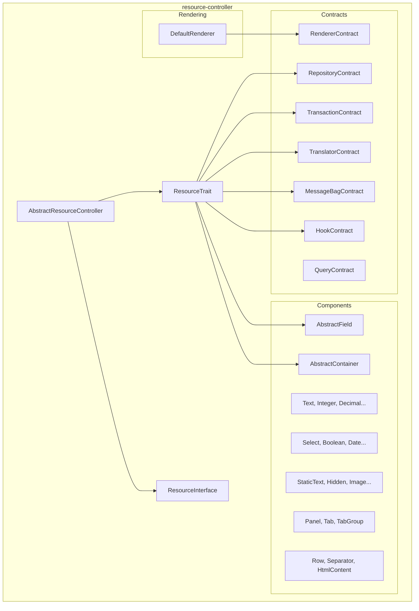

# Estudio del paquete alxarafe/resource-controller

> **Fase**: 2  
> **Prioridad**: Alta  
> **Riesgo**: 🟡 Medio

---

## Resumen ejecutivo

El paquete `alxarafe/resource-controller` (v0.2.1) proporciona un sistema declarativo de CRUD basado en componentes PHP. Los controladores definen su UI devolviendo arrays de campos tipados, y el framework genera la interfaz automáticamente. Es el pilar de la arquitectura moderna de Tahiche.

**Veredicto**: El paquete es sólido en su concepto y ejecución base. Necesita ampliarse con componentes que cubran los casos de uso del ERP y un componente `DataTable` que elimine la necesidad de generar HTML manualmente.

> El inventario detallado de componentes, los gaps identificados y las recomendaciones se encuentran en [ResourceController_Test.md](ResourceController_Test.md) (sección 10).

---

## Arquitectura del paquete



## Componentes existentes (v0.2.1)

### Campos — 15 tipos

| Campo | Tipo HTML | Opciones clave |
|-------|-----------|----------------|
| `Text` | `<input type="text">` | maxlength, placeholder, pattern |
| `Textarea` | `<textarea>` | rows, maxlength |
| `Integer` | `<input type="number">` | min, max, step |
| `Decimal` | `<input type="number">` | precision, scale, min, max |
| `Boolean` | `<input type="checkbox">` | toggle style |
| `Select` | `<select>` | options array |
| `Select2` | `<select>` + JS | AJAX search, tags |
| `Date` | `<input type="date">` | min, max |
| `DateTime` | `<input type="datetime-local">` | — |
| `Time` | `<input type="time">` | — |
| `Hidden` | `<input type="hidden">` | — |
| `StaticText` | HTML libre | Renderiza HTML raw |
| `Icon` | Selector FontAwesome | — |
| `Image` | `` con URL | width control |
| `RelationList` | Tabla de relaciones | columns, foreignKey |

### Contenedores — 7 tipos

| Contenedor | Función |
|-----------|---------|
| `Panel` | Tarjeta Bootstrap card con título |
| `Tab` | Pestaña individual |
| `TabGroup` | Contenedor de pestañas |
| `Row` | Fila sin borde visual |
| `Separator` | Línea divisoria con texto |
| `HtmlContent` | HTML arbitrario |
| `AbstractContainer` | Base abstracta |

## Gaps identificados — Nuevos componentes necesarios

### Prioridad Alta 🔴

#### 1. `DataTable` (Contenedor)

**Justificación**: Actualmente las tablas de datos relacionados (variantes, stock, proveedores en `ProductsController`) se generan con HTML crudo dentro de `StaticText`. Esto rompe la filosofía declarativa.

```php
// Propuesta de API
new DataTable('variantes', [
    'model' => Variante::class,
    'foreignKey' => 'idproducto',
    'columns' => ['referencia', 'descripcion', 'coste', 'precio', 'stock'],
    'actions' => ['edit', 'delete'],
    'pagination' => true,
    'pageSize' => 25,
]);
```

#### 2. `Autocomplete` (Campo)

**Justificación**: Esencial para el ERP. Buscar clientes, productos, cuentas contables por nombre/código. El legacy tiene `AutocompleteFilter` y widgets autocomplete.

```php
new Autocomplete('codcliente', 'Cliente', [
    'source' => '/api/3/clientes',
    'searchField' => 'nombre',
    'valueField' => 'codcliente',
    'displayField' => 'nombre',
    'minChars' => 2,
]);
```

#### 3. `File` (Campo)

**Justificación**: Upload de archivos adjuntos, imágenes de producto, importación CSV.

```php
new File('imagen', 'Imagen del producto', [
    'accept' => 'image/*',
    'maxSize' => '5MB',
    'preview' => true,
]);
```

### Prioridad Media 🟡

#### 4. `Barcode` (Campo)

**Justificación**: Para el plugin de códigos de barras. Validación EAN/UPC, renderizado visual.

```php
new Barcode('ean', 'Código de barras', [
    'format' => 'ean-13',  // ean-8, upc-a, code-128, etc.
    'validate' => true,     // Validar dígito de control
    'render' => true,       // Mostrar representación visual del código
]);
```

#### 5. `Money` (Campo)

**Justificación**: Decimal con formato de moneda.

```php
new Money('total', 'Total', [
    'currency' => 'EUR',
    'position' => 'right',  // Símbolo a la derecha
    'decimals' => 2,
]);
```

#### 6. `Password` (Campo)

**Justificación**: Necesario para la gestión de usuarios.

```php
new Password('password', 'Contraseña', [
    'toggle' => true,       // Botón mostrar/ocultar
    'strength' => true,     // Indicador de fortaleza
    'minlength' => 8,
]);
```

#### 7. `Email`, `Url`, `Phone` (Campos)

**Justificación**: Validación específica en frontend y backend.

```php
new Email('email', 'Email', ['col' => 4]);
new Url('web', 'Sitio web', ['col' => 4]);
new Phone('telefono', 'Teléfono', ['col' => 4]);
```

#### 8. `Modal` (Contenedor)

**Justificación**: Diálogos de confirmación, formularios rápidos de creación.

```php
new Modal('confirm-delete', 'Confirmar eliminación', [
    'body' => '¿Está seguro de eliminar este registro?',
    'confirmButton' => 'Eliminar',
    'confirmClass' => 'btn-danger',
]);
```

### Prioridad Baja 🟢

| Componente | Descripción |
|-----------|-------------|
| `Color` | Selector de color |
| `Radio` | Grupo de radio buttons |
| `CheckboxGroup` | Múltiple selección |
| `RichText` | Editor WYSIWYG |
| `Accordion` | Secciones colapsables |
| `Wizard` | Flujo multi-paso |
| `Number` | Alias de Decimal con formato localizado |

## Mejoras al trait `ResourceTrait`

### 1. Exportación integrada

```php
// Propuesta: trait ExportTrait
trait ExportTrait
{
    protected function getExportFormats(): array
    {
        return ['csv', 'xlsx', 'pdf'];
    }
    
    protected function exportCsv(array $data): void { ... }
    protected function exportXlsx(array $data): void { ... }
    protected function exportPdf(array $data): void { ... }
}
```

### 2. Acciones masivas (Bulk actions)

```php
protected function getBulkActions(): array
{
    return [
        'delete' => ['label' => 'Eliminar seleccionados', 'icon' => 'fas fa-trash', 'confirm' => true],
        'export' => ['label' => 'Exportar seleccionados', 'icon' => 'fas fa-download'],
    ];
}
```

### 3. Búsqueda global en UI

El `ResourceTrait` ya soporta `$globalSearchFields`, pero no está expuesto como componente en la barra de herramientas del listado. Se debería renderizar automáticamente si `$globalSearchFields` tiene contenido.

### 4. Validación JavaScript integrada

Los metadatos de constraints (maxlength, min, max, required, pattern) ya se propagan al descriptor JSON. Falta una librería JS mínima que:
- Intercepte el submit del formulario
- Valide según los metadatos
- Muestre errores inline con Bootstrap classes

## Roadmap propuesto para `resource-controller`

| Versión | Componentes | Funcionalidades |
|---------|------------|----------------|
| **v0.3.0** | `DataTable`, `Autocomplete`, `File` | Búsqueda global en UI |
| **v0.4.0** | `Barcode`, `Money`, `Password`, `Email`, `Url`, `Phone` | Bulk actions |
| **v0.5.0** | `Modal`, mejoras a `RelationList` | Export trait (CSV, XLSX) |
| **v0.6.0** | `Color`, `Radio`, `RichText` | Validación JS integrada |

## Extensión local en Tahiche

> **Si las mejoras propuestas no se implementan en el paquete upstream `alxarafe/resource-controller`, Tahiche puede extenderlo localmente** creando nuevos componentes en `src/Infrastructure/Component/`. El sistema de herencia ya está preparado para esto.

### Mecanismo existente — Ya probado ✅

Tahiche ya tiene un componente custom local: `DetailLines`, ubicado en `src/Infrastructure/Component/Container/DetailLines.php`. Este componente extiende `AbstractContainer` del paquete para crear grids editables de líneas de detalle (ej: líneas de factura):

```php
namespace Tahiche\Infrastructure\Component\Container;

use Alxarafe\ResourceController\Component\Container\AbstractContainer;

class DetailLines extends AbstractContainer
{
    protected string $component = 'detail_lines';
    
    // Propiedades específicas: modelClass, foreignKey, sortable, 
    // addRow, removeRow, autoRecalculate, footerTotals...
}
```

### Patrón para crear componentes custom

#### Nuevo campo (extiende `AbstractField`)

```php
// src/Infrastructure/Component/Fields/Barcode.php
namespace Tahiche\Infrastructure\Component\Fields;

use Alxarafe\ResourceController\Component\AbstractField;

class Barcode extends AbstractField
{
    protected string $component = 'barcode';
    
    public function __construct(string $field, string $label, array $options = [])
    {
        $options['format'] = $options['format'] ?? 'ean-13';
        $options['validate'] = $options['validate'] ?? true;
        parent::__construct($field, $label, $options);
    }

    public function getType(): string { return 'barcode'; }
}
```

#### Nuevo contenedor (extiende `AbstractContainer`)

```php
// src/Infrastructure/Component/Container/DataTable.php
namespace Tahiche\Infrastructure\Component\Container;

use Alxarafe\ResourceController\Component\Container\AbstractContainer;

class DataTable extends AbstractContainer
{
    protected string $component = 'data_table';
    // ... lógica de tabla de datos con paginación
    
    public function getContainerType(): string { return 'data_table'; }
}
```

### Estructura de extensión

```
src/Infrastructure/Component/
├── Container/
│   ├── DetailLines.php      # ✅ Ya existe — grid editable
│   ├── DataTable.php         # 🔜 Por crear — tabla de datos relacionados
│   └── Modal.php             # 🔜 Por crear — diálogos modales
└── Fields/
    ├── Barcode.php            # 🔜 Por crear — campo de código de barras
    ├── Money.php              # 🔜 Por crear — campo monetario
    ├── Password.php           # 🔜 Por crear — campo de contraseña
    ├── Email.php              # 🔜 Por crear — campo de email
    └── Autocomplete.php       # 🔜 Por crear — campo con búsqueda AJAX
```

### Ventajas de la extensión local

1. **Sin dependencia upstream**: No necesita esperar a que el paquete publique nuevas versiones.
2. **Específico para el ERP**: Los componentes pueden tener lógica de negocio específica de Tahiche.
3. **Promocionable**: Si un componente local resulta genérico y útil, se puede proponer como PR al paquete upstream para beneficio del ecosistema.
4. **Sin conflictos**: Los namespaces están separados (`Tahiche\Infrastructure\Component\*` vs `Alxarafe\ResourceController\Component\*`).

---

## Checklist


- [ ] Crear componente `DataTable` en resource-controller
- [ ] Crear campo `Autocomplete`
- [ ] Crear campo `File`
- [ ] Crear campo `Barcode`
- [ ] Crear campos auxiliares (Money, Password, Email, Url, Phone)
- [ ] Implementar búsqueda global en UI de listados
- [ ] Implementar bulk actions
- [ ] Implementar export trait
- [ ] Implementar validación JS cliente
- [ ] Actualizar showcase (resource-test) con nuevos componentes
- [ ] Publicar versión 0.3.0
