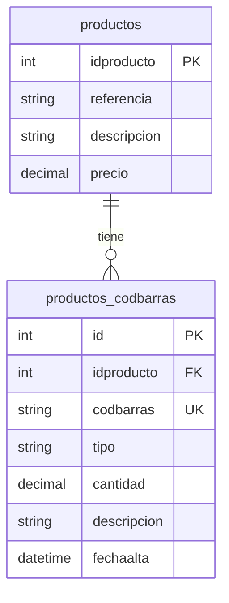

# Plugin de Códigos de Barras

> **Fase**: 3  
> **Prioridad**: Alta  
> **Riesgo**: 🟡 Medio  
> **Arquitectura**: Nueva (Modules/, ResourceController)

---

## Requisitos funcionales

### RF-01: Múltiples códigos de barras por producto
Un producto puede tener **N códigos de barras** asociados. Cada uno representa un formato de empaquetado, origen de fabricación, o variante.

### RF-02: Datos por código de barras
Cada registro de código de barras tiene:
- **Código**: El valor numérico/alfanumérico del código de barras
- **Tipo**: EAN-13, EAN-8, UPC-A, UPC-E, Code-128, Code-39, ITF-14, GS1-128
- **Cantidad**: Número de unidades que representa (por defecto: 1)
- **Descripción** (opcional): Texto libre para identificar el formato (ej: "Pack 6 unidades", "Fabricado en Portugal")

### RF-03: Búsqueda por código de barras
Al introducir un código de barras en cualquier punto del sistema (ventas, compras, inventario), el sistema debe:
1. Buscar en todos los códigos de barras registrados
2. Devolver el **producto** asociado
3. Devolver la **cantidad** del código encontrado

### RF-04: Ejemplo de caso de uso

| Producto | EAN | Tipo | Cantidad | Descripción |
|----------|-----|------|----------|-------------|
| Coca-Cola 33cl | 5449000000996 | EAN-13 | 1 | Unidad - España |
| Coca-Cola 33cl | 5449000131805 | EAN-13 | 1 | Unidad - Portugal |
| Coca-Cola 33cl | 5449000054227 | EAN-13 | 6 | Pack 6 unidades |
| Coca-Cola 33cl | 5449000054234 | EAN-13 | 12 | Pack 12 unidades |
| Coca-Cola 33cl | 5449000054241 | EAN-13 | 24 | Caja 24 unidades |

Al escanear `5449000054227` en un TPV, el sistema agrega 6 unidades de Coca-Cola 33cl.

---

## Modelo de datos

### Tabla: `productos_codbarras`

```sql
CREATE TABLE productos_codbarras (
    id INT AUTO_INCREMENT PRIMARY KEY,
    idproducto INT NOT NULL,
    codbarras VARCHAR(128) NOT NULL,
    tipo VARCHAR(20) NOT NULL DEFAULT 'EAN-13',
    cantidad DECIMAL(12,2) NOT NULL DEFAULT 1,
    descripcion VARCHAR(200) DEFAULT NULL,
    fechaalta DATETIME NOT NULL DEFAULT CURRENT_TIMESTAMP,
    
    -- Índices
    INDEX idx_codbarras (codbarras),
    INDEX idx_idproducto (idproducto),
    UNIQUE INDEX uniq_codbarras (codbarras),
    
    -- Foreign key
    CONSTRAINT fk_prodbarras_producto 
        FOREIGN KEY (idproducto) REFERENCES productos(idproducto)
        ON DELETE CASCADE ON UPDATE CASCADE
) ENGINE=InnoDB DEFAULT CHARSET=utf8mb4;
```

### Diagrama ER



---

## Estructura del plugin

```
Modules/Trading/                      # Se integra en el módulo Trading
├── Controller/
│   └── ProductBarcodesController.php  # Controlador CRUD del plugin
├── Model/
│   └── ProductBarcode.php            # Modelo con ORM legacy
└── Migration/
    └── 20260425000000_create_product_barcodes_table.php
```

**Nota**: Se ubica dentro de `Modules/Trading/` porque los códigos de barras son funcionalidad del dominio de comercio/productos, no un plugin independiente. Si se prefiere como plugin separado, podría ser `Plugins/Barcodes/`.

### Alternativa como Plugin legacy-compatible

```
Plugins/Barcodes/
├── facturascripts.ini
├── Init.php
├── Controller/
│   └── ProductBarcodesController.php
├── Model/
│   └── ProductoCodigoBarras.php
├── Table/
│   └── productos_codbarras.xml
├── Extension/
│   └── Controller/
│       └── EditProducto.php          # Inyecta pestaña en EditProducto
└── Translation/
    └── es_ES.json
```

---

## Implementación

### Modelo: `ProductBarcode.php`

```php
<?php
namespace Modules\Trading\Model;

use FacturaScripts\Core\Model\Base\ModelClass;
use FacturaScripts\Core\Model\Base\ModelTrait;
use FacturaScripts\Core\Tools;

class ProductBarcode extends ModelClass
{
    use ModelTrait;

    public ?int $id = null;
    public int $idproducto;
    public string $codbarras = '';
    public string $tipo = 'EAN-13';
    public float $cantidad = 1;
    public ?string $descripcion = null;
    public string $fechaalta;

    public static function primaryColumn(): string { return 'id'; }
    public static function tableName(): string { return 'productos_codbarras'; }

    /**
     * Busca un producto por código de barras.
     * Devuelve [producto, cantidad] o null si no encuentra.
     */
    public static function findByBarcode(string $code): ?array
    {
        $barcode = new self();
        if ($barcode->loadFromCode('', [
            new \FacturaScripts\Core\Where('codbarras', '=', $code)
        ])) {
            $product = new \FacturaScripts\Core\Model\Producto();
            if ($product->loadFromCode('', [
                new \FacturaScripts\Core\Where('idproducto', '=', $barcode->idproducto)
            ])) {
                return [
                    'producto' => $product,
                    'cantidad' => $barcode->cantidad,
                    'barcode' => $barcode,
                ];
            }
        }
        return null;
    }

    /**
     * Valida el dígito de control de un EAN-13.
     */
    public function test(): bool
    {
        $this->codbarras = trim($this->codbarras);
        if (empty($this->codbarras)) {
            Tools::log()->warning('barcode-empty');
            return false;
        }
        if ($this->cantidad <= 0) {
            $this->cantidad = 1;
        }
        return parent::test();
    }

    /**
     * Tipos de código de barras soportados.
     */
    public static function barcodeTypes(): array
    {
        return [
            'EAN-13' => 'EAN-13 (International)',
            'EAN-8' => 'EAN-8 (Compacto)',
            'UPC-A' => 'UPC-A (Norte América)',
            'UPC-E' => 'UPC-E (Compacto NA)',
            'Code-128' => 'Code 128 (Alfanumérico)',
            'Code-39' => 'Code 39',
            'ITF-14' => 'ITF-14 (Cajas/Pallets)',
            'GS1-128' => 'GS1-128 (Logística)',
            'QR' => 'QR Code',
            'DataMatrix' => 'Data Matrix',
        ];
    }
}
```

### Controlador: `ProductBarcodesController.php`

```php
<?php
namespace Modules\Trading\Controller;

use Alxarafe\ResourceController\Component\Fields\{Text, Select, Decimal, Textarea, Hidden, DateTime};
use FacturaScripts\Core\Tools;
use Tahiche\Infrastructure\Http\ResourceController;
use Modules\Trading\Model\ProductBarcode;

class ProductBarcodesController extends ResourceController
{
    use \Tahiche\Infrastructure\Http\LegacyBridgeTrait;

    protected function getModelClassName(): string
    {
        return ProductBarcode::class;
    }

    public function getListColumns(): array
    {
        return ['codbarras', 'tipo', 'cantidad', 'descripcion'];
    }

    public function getEditFields(): array
    {
        $tipos = ProductBarcode::barcodeTypes();

        return [
            'barcode' => [
                'label' => Tools::trans('barcode'),
                'icon' => 'fas fa-barcode',
                'fields' => [
                    new Hidden('id', 'ID'),
                    new Hidden('idproducto', 'ID Producto'),
                    new Text('codbarras', Tools::trans('barcode'), [
                        'col' => 6, 'maxlength' => 128, 'required' => true,
                        'placeholder' => 'Ej: 5449000000996'
                    ]),
                    new Select('tipo', Tools::trans('type'), $tipos, [
                        'col' => 3, 'required' => true
                    ]),
                    new Decimal('cantidad', Tools::trans('quantity'), [
                        'col' => 3, 'min' => 0.01, 'step' => 0.01
                    ]),
                    new Textarea('descripcion', Tools::trans('description'), [
                        'col' => 12, 'rows' => 2
                    ]),
                ],
            ],
        ];
    }
}
```

### Integración en ProductsController

Añadir pestaña de códigos de barras en `ProductsController.php`:

```php
// En getEditFields(), después de las pestañas existentes:
if ($id) {
    $tabs['barcodes'] = [
        'label' => Tools::trans('barcodes'),
        'icon' => 'fas fa-barcode',
        'badge' => $this->getBadgeCount('barcodes', $badges),
        'fields' => $this->buildRelatedTable(
            ProductBarcode::class, // ← o el namespace completo
            'idproducto', 
            $id
        ),
    ];
}
```

### API de búsqueda

Endpoint para buscar productos por código de barras:

```php
// En el router o como API endpoint:
// GET /api/3/barcode-search?code=5449000054227

$result = ProductBarcode::findByBarcode($code);
// Devuelve:
// {
//   "producto": { "idproducto": 1, "referencia": "COCA33", "descripcion": "Coca-Cola 33cl" },
//   "cantidad": 6,
//   "barcode": { "codbarras": "5449000054227", "tipo": "EAN-13", "descripcion": "Pack 6 unidades" }
// }
```

---

## Validación de códigos EAN

### Algoritmo de dígito de control EAN-13

```php
public static function validateEan13(string $code): bool
{
    if (strlen($code) !== 13 || !ctype_digit($code)) {
        return false;
    }
    
    $sum = 0;
    for ($i = 0; $i < 12; $i++) {
        $sum += (int)$code[$i] * ($i % 2 === 0 ? 1 : 3);
    }
    
    $checkDigit = (10 - ($sum % 10)) % 10;
    return $checkDigit === (int)$code[12];
}
```

---

## Checklist de implementación

- [ ] Crear tabla `productos_codbarras` (migración SQL)
- [ ] Crear modelo `ProductBarcode` con validación EAN
- [ ] Crear controlador `ProductBarcodesController`
- [ ] Integrar como pestaña en `ProductsController`
- [ ] Crear endpoint API de búsqueda por código de barras
- [ ] Añadir badge con conteo en la pestaña
- [ ] Integrar búsqueda por barcode en `MegaSearch`
- [ ] Tests unitarios para validación EAN
- [ ] Tests de integración para búsqueda
- [ ] Traducciones (es_ES, en_EN)
- [ ] Campo `Barcode` en resource-controller (si se implementa)
