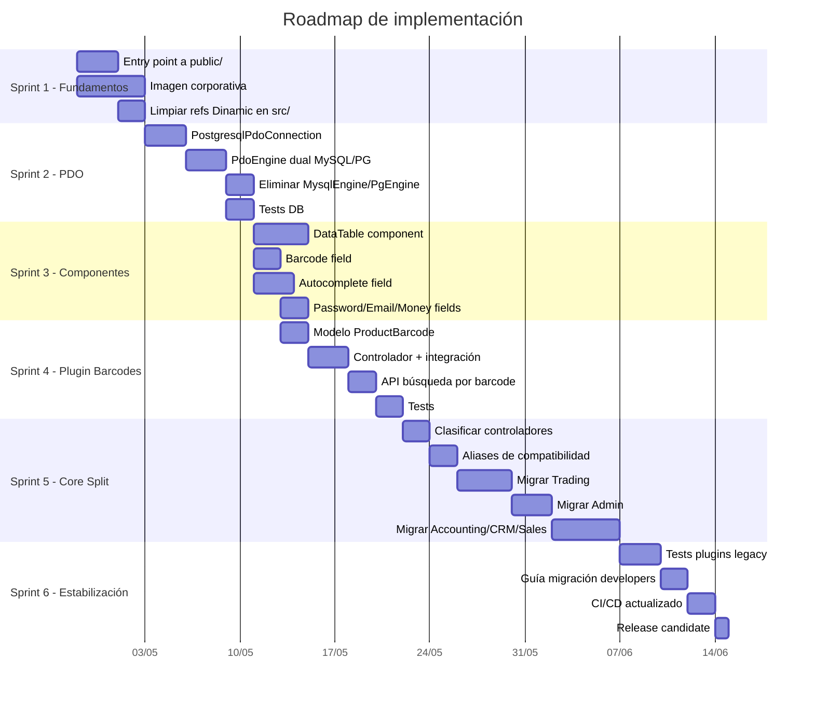
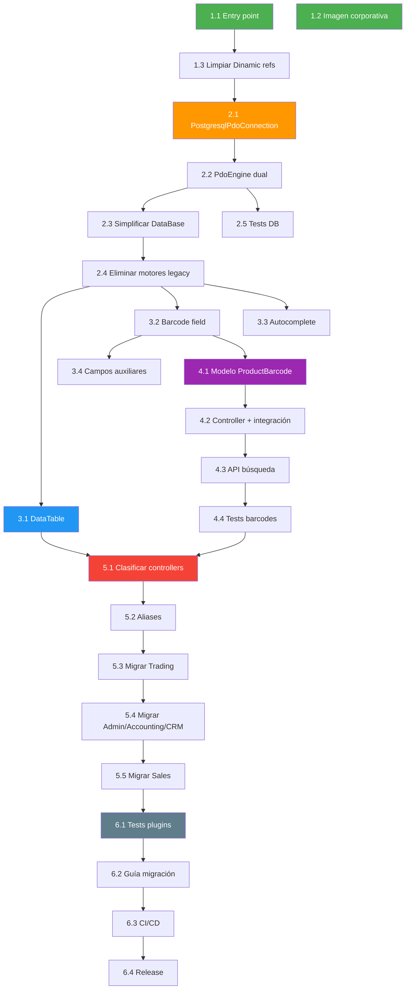

# Plan de Implementación — Tahiche

> **Fecha**: 2026-04-25  
> **Referencia**: [02_plan_maestro.md](02_plan_maestro.md) para la visión general de fases

---

## Resumen del enfoque

El plan se organiza en **6 sprints** de 2 semanas. Cada sprint produce un entregable funcional donde todo sigue funcionando (green tests). Las tareas están ordenadas por **dependencia**, no por importancia subjetiva.

---

## Sprint 1 — Fundamentos (Semana 1-2)

> **Objetivo**: Base segura, identidad propia, código nuevo limpio de Dinamic.

### Tarea 1.1 — Entry point a `public/` ⏱️ 3h

**Estado actual**: Nginx ya apunta a `public/`. Faltan protecciones para otros entornos.

| Paso | Acción | Archivo |
|------|--------|---------|
| 1 | Crear `index.php` redirector en root | `/index.php` (nuevo) |
| 2 | Crear `.htaccess` en root con protección de archivos sensibles | `/.htaccess` (nuevo) |
| 3 | Añadir reglas de caché para assets estáticos en nginx | `.docker/nginx/default.conf` |
| 4 | Actualizar script `dev-server` en composer.json | `composer.json` |
| 5 | Eliminar `htaccess-sample` y `cookie.txt` | Root |
| 6 | Verificar que todas las rutas funcionan | Manual + test |

**Criterio de aceptación**: `http://localhost:8086` funciona, archivos sensibles no accesibles vía web.

---

### Tarea 1.2 — Imagen corporativa ⏱️ 1d

| Paso | Acción | Archivo |
|------|--------|---------|
| 1 | Definir paleta de colores definitiva | `docs/04_imagen_corporativa.md` |
| 2 | Generar logo SVG de Tahiche | `public/Assets/Images/tahiche-logo.svg` |
| 3 | Generar favicon | `public/Assets/Images/favicon.ico` |
| 4 | Crear CSS de tema con variables Bootstrap | `public/themes/tahiche/tahiche.css` |
| 5 | Actualizar plantilla de login | `Core/View/Login.html.twig` (override) |
| 6 | Actualizar MenuTemplate con nuevo logo | Template override |
| 7 | Actualizar `<title>` y meta tags | Templates |
| 8 | Footer: "Tahiche, basado en FacturaScripts" | Templates |

**Criterio de aceptación**: La aplicación muestra branding Tahiche, no FacturaScripts.

---

### Tarea 1.3 — Limpiar referencias a Dinamic en código nuevo ⏱️ 2h

| Paso | Acción | Archivo |
|------|--------|---------|
| 1 | Buscar `FacturaScripts\Dinamic\` en `src/` | `grep -r` |
| 2 | Reemplazar `Dinamic\Model\User` → `Core\Model\User` en Kernel | `src/Infrastructure/Http/Kernel.php` |
| 3 | Buscar `FacturaScripts\Dinamic\` en `Modules/` | `grep -r` |
| 4 | Reemplazar refs a `Dinamic\Model\*` por `Core\Model\*` en controllers | `Modules/*/Controller/*.php` |
| 5 | Verificar que todo funciona | Tests + manual |

**Criterio de aceptación**: `grep -r 'Dinamic' src/ Modules/` devuelve 0 resultados directos (excepto `LegacyBridgeTrait` que los consume dinámicamente).

---

## Sprint 2 — Base de datos PDO unificada (Semana 3-4)

> **Objetivo**: Un solo motor PDO para MySQL y PostgreSQL.

### Tarea 2.1 — Crear PostgresqlPdoConnection ⏱️ 4h

| Paso | Acción | Archivo |
|------|--------|---------|
| 1 | Crear clase que implemente `DatabaseConnectionInterface` | `src/Infrastructure/Database/PostgresqlPdoConnection.php` |
| 2 | DSN format: `pgsql:host=...;port=...;dbname=...` | — |
| 3 | Escape de columnas con `"` en lugar de `` ` `` | — |
| 4 | `SET DATESTYLE TO ISO, YMD;` en connect | — |
| 5 | Tests unitarios | `Tests/Infrastructure/Database/PostgresqlPdoConnectionTest.php` |

---

### Tarea 2.2 — PdoEngine dual MySQL/PostgreSQL ⏱️ 4h

| Paso | Acción | Archivo |
|------|--------|---------|
| 1 | Añadir método `detectDriver()` | `Core/Base/DataBase/PdoEngine.php` |
| 2 | Usar `MysqlQueries` o `PostgresqlQueries` según driver | — |
| 3 | Crear conexión con la clase correcta según driver | — |
| 4 | Métodos `random()`, `castInteger()` dinámicos según driver | — |
| 5 | Mantener compatibilidad con valores de config antiguos | — |

---

### Tarea 2.3 — Simplificar DataBase.php ⏱️ 1h

| Paso | Acción | Archivo |
|------|--------|---------|
| 1 | Eliminar switch de motores: siempre `new PdoEngine()` | `Core/Base/DataBase.php` |
| 2 | Mantener detección de tipo para PostgreSQL vs MySQL | — |

---

### Tarea 2.4 — Eliminar motores legacy ⏱️ 1h

| Paso | Acción | Archivo |
|------|--------|---------|
| 1 | Eliminar `MysqlEngine.php` | `Core/Base/DataBase/MysqlEngine.php` |
| 2 | Eliminar `PostgresqlEngine.php` | `Core/Base/DataBase/PostgresqlEngine.php` |
| 3 | Actualizar imports en `DataBase.php` | `Core/Base/DataBase.php` |
| 4 | Revisar `Installer.php` por referencias a mysqli/pg | `Core/Controller/Installer.php` |
| 5 | Actualizar `composer.json` (ext requirements) | `composer.json` |

---

### Tarea 2.5 — Tests de base de datos ⏱️ 3h

| Test | Cobertura |
|------|-----------|
| Conexión MySQL PDO | Connect, disconnect, reconnect |
| Conexión PostgreSQL PDO | Connect, disconnect, reconnect |
| CRUD MySQL | Insert, select, update, delete |
| CRUD PostgreSQL | Insert, select, update, delete |
| Transacciones | Begin, commit, rollback, nested |
| Escape | Strings, columnas, valores especiales |
| Schema | listTables, getColumns, getConstraints |
| Compatibilidad | StockAvanzado funciona con PdoEngine |

**Criterio de aceptación**: Todos los tests pasan con MySQL Y con PostgreSQL. `phpunit` green.

---

## Sprint 3 — Componentes nuevos (Semana 5-6)

> **Objetivo**: Componentes que cubran los gaps del ERP, creados localmente en Tahiche.

### Tarea 3.1 — Componente `DataTable` ⏱️ 1d

Reemplazar el patrón `buildRelatedTable()` con HTML crudo.

| Paso | Acción | Archivo |
|------|--------|---------|
| 1 | Crear clase `DataTable extends AbstractContainer` | `src/Infrastructure/Component/Container/DataTable.php` |
| 2 | Props: model, foreignKey, columns, actions, pagination | — |
| 3 | Renderizado: tabla Bootstrap con paginación | — |
| 4 | Integrar en `resource.bundle.js` (renderizado frontend) | `public/js/` |
| 5 | Refactorizar `ProductsController.buildRelatedTable()` | `Modules/Trading/Controller/ProductsController.php` |
| 6 | Verificar tabs de variantes, stock, proveedores | Manual |

---

### Tarea 3.2 — Campo `Barcode` ⏱️ 3h

| Paso | Acción | Archivo |
|------|--------|---------|
| 1 | Crear clase `Barcode extends AbstractField` | `src/Infrastructure/Component/Fields/Barcode.php` |
| 2 | Props: format (ean-13, ean-8...), validate, render | — |
| 3 | Validación EAN-13 server-side | Método `validateEan13()` |
| 4 | Renderizado visual del código en el frontend | JS |

---

### Tarea 3.3 — Campo `Autocomplete` ⏱️ 4h

| Paso | Acción | Archivo |
|------|--------|---------|
| 1 | Crear clase `Autocomplete extends AbstractField` | `src/Infrastructure/Component/Fields/Autocomplete.php` |
| 2 | Props: source URL, searchField, valueField, displayField, minChars | — |
| 3 | Frontend: input con dropdown de resultados AJAX | JS |
| 4 | Integrar con API existente del legacy | — |

---

### Tarea 3.4 — Campos auxiliares ⏱️ 3h

| Campo | Clase base | Especificidad |
|-------|-----------|---------------|
| `Password` | `Text` | `type="password"`, toggle visibilidad |
| `Email` | `Text` | `type="email"`, validación |
| `Phone` | `Text` | `type="tel"`, formato |
| `Url` | `Text` | `type="url"`, validación |
| `Money` | `Decimal` | Símbolo de moneda, formato localizado |

Ubicación: `src/Infrastructure/Component/Fields/`

**Criterio de aceptación**: Todos los componentes se renderizan correctamente en un controlador de test.

---

## Sprint 4 — Plugin de Códigos de Barras (Semana 7-8)

> **Objetivo**: Plugin funcional con búsqueda por EAN.

### Tarea 4.1 — Modelo y migración ⏱️ 3h

| Paso | Acción | Archivo |
|------|--------|---------|
| 1 | Crear definición de tabla XML | `Modules/Trading/Table/productos_codbarras.xml` |
| 2 | Crear modelo `ProductBarcode` | `Modules/Trading/Model/ProductBarcode.php` |
| 3 | Implementar `findByBarcode()` estático | — |
| 4 | Implementar `barcodeTypes()` | — |
| 5 | Implementar validación `test()` con checksum EAN | — |
| 6 | Tests unitarios del modelo | `Tests/Modules/Trading/Model/ProductBarcodeTest.php` |

---

### Tarea 4.2 — Controlador e integración ⏱️ 4h

| Paso | Acción | Archivo |
|------|--------|---------|
| 1 | Crear `ProductBarcodesController` | `Modules/Trading/Controller/ProductBarcodesController.php` |
| 2 | Definir campos: codbarras, tipo (Select), cantidad, descripcion | — |
| 3 | Añadir pestaña "Códigos de barras" en `ProductsController` | `Modules/Trading/Controller/ProductsController.php` |
| 4 | Badge con conteo en la pestaña | `getTabBadges()` |
| 5 | Usar campo `Barcode` si está disponible, o `Text` con validación | — |

---

### Tarea 4.3 — API de búsqueda ⏱️ 3h

| Paso | Acción | Archivo |
|------|--------|---------|
| 1 | Crear endpoint `GET /api/3/barcode-search?code=XXX` | Nuevo controlador API o ruta |
| 2 | Devolver: producto, cantidad, datos del barcode | — |
| 3 | Integrar en `MegaSearch` (búsqueda global) | `Core/Controller/MegaSearch.php` (extension) |
| 4 | Tests de integración | — |

---

### Tarea 4.4 — Traducciones y tests ⏱️ 2h

| Paso | Acción | Archivo |
|------|--------|---------|
| 1 | Traducciones es_ES y en_EN | `Modules/Trading/Translation/` |
| 2 | Test: crear barcode, buscar, verificar cantidad | PHPUnit |
| 3 | Test: validación EAN-13 (válidos e inválidos) | PHPUnit |
| 4 | Test: múltiples barcodes por producto | PHPUnit |

**Criterio de aceptación**: Crear producto → añadir 3 EAN con distintas cantidades → buscar por cualquier EAN → devuelve producto y cantidad correcta.

---

## Sprint 5 — Separación Core / Módulos (Semana 9-12)

> **Objetivo**: Core solo contiene infraestructura. Negocio en Modules.

### Tarea 5.1 — Clasificación definitiva ⏱️ 2h

| Paso | Acción |
|------|--------|
| 1 | Revisar clasificación en `05_limpieza_nucleo.md` con el usuario |
| 2 | Marcar controladores dudosos (API de documentos, CopyModel...) |
| 3 | Decidir si los modelos se mueven o se mantienen en Core |

---

### Tarea 5.2 — Sistema de aliases ⏱️ 3h

| Paso | Acción | Archivo |
|------|--------|---------|
| 1 | Crear `LegacySupport::registerAliases()` | `src/Infrastructure/Compatibility/LegacySupport.php` |
| 2 | Llamar en el bootstrap del Kernel | `src/Infrastructure/Http/Kernel.php` |
| 3 | Documentar el patrón para cada controlador migrado | — |

---

### Tarea 5.3 — Migrar Trading ⏱️ 2d

Ya tiene 21 controllers en `Modules/Trading/`. Falta:

| Paso | Acción |
|------|--------|
| 1 | Verificar que los 21 controllers cubren todos los del Core |
| 2 | Crear aliases para los que falten |
| 3 | Actualizar rutas en `MenuManager` / tabla `pages` |
| 4 | Verificar que plugins que extienden EditProducto siguen funcionando |

---

### Tarea 5.4 — Migrar Admin, Accounting, CRM ⏱️ 3d

| Módulo | Controllers a cubrir | Ya en Modules |
|--------|---------------------|---------------|
| Admin | 11 | 11 ✅ |
| Accounting | 12 | 7 (faltan 5) |
| CRM | 8 | 4 (faltan 4) |

---

### Tarea 5.5 — Migrar Sales ⏱️ 3d

El más complejo por la lógica de documentos comerciales:

| Paso | Acción |
|------|--------|
| 1 | Crear controllers para Presupuestos, Pedidos, Albaranes, Facturas |
| 2 | Integrar `DetailLines` para líneas de documento |
| 3 | Mantener la lógica de transformación de documentos |
| 4 | Aliases de compatibilidad |

**Criterio de aceptación**: `Core/Controller/` solo tiene ~15 controladores de infraestructura. Todos los plugins siguen funcionando.

---

## Sprint 6 — Estabilización (Semana 13-14)

> **Objetivo**: Todo funciona, está testeado y documentado.

### Tarea 6.1 — Tests de compatibilidad ⏱️ 1d

| Test | Plugin | Verificación |
|------|--------|-------------|
| Instalación | StockAvanzado | Se instala y activa |
| Extensiones | StockAvanzado | Pestaña "Movimientos" aparece en Productos |
| API custom | StockAvanzado | Endpoints de counting/transfer funcionan |
| Modelos | StockAvanzado | Tablas se crean correctamente |
| Workers | StockAvanzado | Workers se registran |

---

### Tarea 6.2 — Guía de migración ⏱️ 4h

Crear `docs/guia_migracion_plugins.md`:
- Cómo adaptar un plugin para Tahiche
- Tabla de equivalencias: old API → new API
- Ejemplo paso a paso con un plugin sencillo

---

### Tarea 6.3 — CI/CD ⏱️ 3h

| Paso | Acción |
|------|--------|
| 1 | Actualizar GitHub Actions para incluir tests de plugins |
| 2 | Añadir test con PostgreSQL (Docker service) |
| 3 | Verificar PHPStan, PHPCS con nueva estructura |

---

### Tarea 6.4 — Release candidate ⏱️ 1h

| Paso | Acción |
|------|--------|
| 1 | Tag de versión |
| 2 | Actualizar README con nueva documentación |
| 3 | Changelog |

---

## Resumen de esfuerzo estimado

| Sprint | Enfoque | Esfuerzo estimado |
|--------|---------|-------------------|
| **Sprint 1** | Fundamentos | ~1.5 días |
| **Sprint 2** | PDO unificado | ~2 días |
| **Sprint 3** | Componentes | ~3 días |
| **Sprint 4** | Plugin Barcodes | ~2 días |
| **Sprint 5** | Core Split | ~8 días |
| **Sprint 6** | Estabilización | ~2.5 días |
| **Total** | | **~19 días de desarrollo** |

---

## Orden de ejecución recomendado

Si se quiere avanzar en paralelo o priorizar de forma diferente:

> **Las tareas 1.1, 1.2 y 1.3 son independientes y se pueden ejecutar en paralelo.** Los sprints 3 y 4 (componentes + barcodes) se pueden hacer en paralelo parcialmente. El sprint 5 (Core split) es el más largo y arriesgado — requiere atención continua a la compatibilidad.

---

## ¿Por dónde empezar?

**Recomendación**: Empezar por **Sprint 1** completo (es rápido, ~1.5 días, y deja el proyecto con una base limpia). Luego atacar **Sprint 2** (PDO) porque simplifica la infraestructura para todo lo demás.
